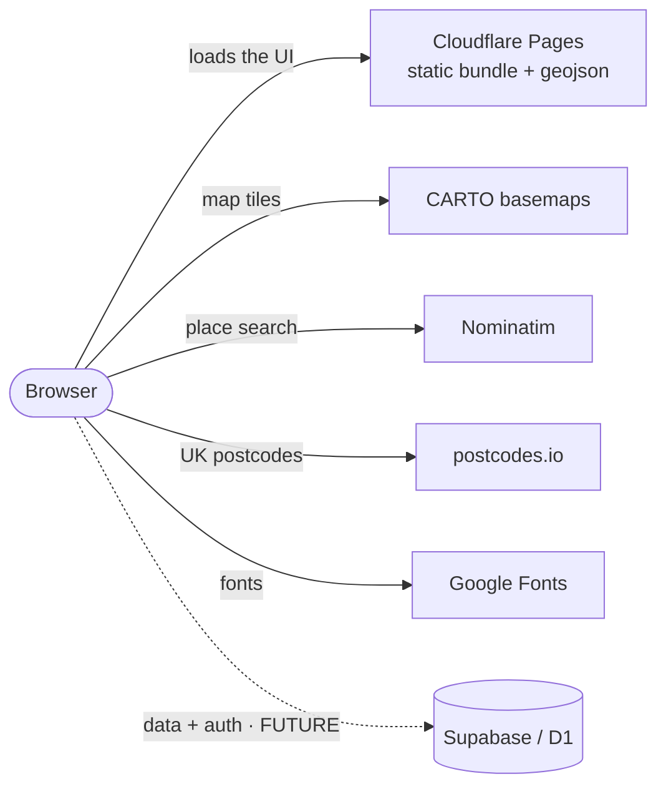

# Deployment & runtime architecture — RoutesWallet web

How the web app is hosted, what it depends on at runtime, and where a database
slots in later. Written so the deploy story doesn't live only in someone's head.

> **Status:** deployed & live on **Cloudflare Pages** (`*.pages.dev`; custom
> domain `routeswallet.app` still optional-later). **v2 (TB-110)** adds a thin
> serverless edge — two Pages Functions + one D1 table — for the member-contributed
> route pool; the pivot §8 anticipated has been taken (see §8a for the runbook).

## 1. What it is

A **static single-page app** — Vite + React + TypeScript, Leaflet + Turf. The app
itself is still 100% static files a CDN serves — nothing to keep warm, scale, or
patch. The **only** server code is the thin v2 member-pool edge (two Cloudflare
Pages Functions + one D1 table; §8a); the SPA still has no backend of its own and
the Strava login is the only auth.

Route data ships **as static files in the bundle** today:
`public/routes.geojson` (~6 MB, ~1–2 MB after the CDN's brotli),
`public/pois.geojson`, `public/designated-areas.geojson`.

## 2. Runtime architecture

The browser loads the UI from one place and talks to a few keyless third-party
services directly. The host never changes to add or swap any of them.



The dotted arrow is the only thing that gets added when a database lands
(§8) — the solid ones, including the host, stay put.

## 3. Hosting: Cloudflare Pages

Chosen because it satisfies every constraint (free, 24/7, low-volume, won't need
switching) with the most headroom:

- **Free, no bandwidth cap**, global CDN, always-on (static = no cold starts).
- Serves at the **domain root**, so Vite's default `base: '/'` just works (no
  subpath rewriting — a real gotcha on GitHub Pages project sites).
- **Commercial use allowed** on the free tier (Vercel's Hobby tier isn't — avoid).
- Built-in **privacy-first analytics** (§7) and a free path to server bits later
  (Workers + D1) if we ever want them.

Runner-up: **Netlify** (equivalent, but 100 GB/mo bandwidth cap). **GitHub
Pages** works but is the most limited and needs a build workflow.

## 4. First-time deploy (Cloudflare Pages)

1. Cloudflare dashboard → **Workers & Pages → Create → Pages → Connect to Git**,
   pick the `RoutesWallet` repo.
2. Build settings:
   - **Root directory:** `web` &nbsp;(this is a loose monorepo — the app is in `web/`)
   - **Framework preset:** Vite
   - **Build command:** `npm run build`
   - **Build output directory:** `dist`
3. **Production branch:** `main`. (Work currently lives on `web-map`; either merge
   to `main` first, or point Pages at `web-map` to preview before merging.) Every
   push to the production branch auto-deploys; PRs get their own preview URL.
4. First deploy gives a `*.pages.dev` URL. **Custom domain** later:
   Pages → Custom domains → add `routeswallet.app`; Cloudflare handles DNS + SSL.

No servers, no Docker, no CI secrets — Cloudflare builds from the repo on push.

## 5. Build output & caching

- `npm run build` = `tsc --noEmit && vite build` → `web/dist/`: `index.html`,
  content-hashed `/assets/*.js|css`, and everything in `public/` copied to the
  root (the `.geojson` files).
- Hashed asset filenames change on every content change, so they can be cached
  forever; the geojson keeps a stable name, so it gets a short cache to let data
  updates propagate. This lives in [`web/public/_headers`](../web/public/_headers)
  (honoured by Cloudflare Pages **and** Netlify; ignored harmlessly elsewhere).

## 6. External services (the real "will we have to switch?" list)

The host is future-proof; these keyless services are what to watch as usage
grows. Each is an **independent swap** that never touches the host.

| Service          | Used for              | Free-tier reality                          | Swap path if it grows            |
| ---------------- | --------------------- | ------------------------------------------ | -------------------------------- |
| **CARTO**        | basemap tiles (the map you see) | fine at low volume; attribution required | MapTiler / Stadia / CyclOSM (TB-50) |
| **Nominatim**    | place-name search     | OSM policy ~1 req/s, no bulk use           | keyed geocoder (MapTiler, LocationIQ) |
| **postcodes.io** | UK postcode → point   | free, no key, generous, ONS-complete       | self-host (it's open source)     |
| **Google Fonts** | Inter / IBM Plex Mono | free CDN                                    | self-host the fonts (GDPR/privacy) |

## 7. Analytics (privacy-first, when ready)

Requirement: **anonymous, event-level, no per-user tracking**. **Cloudflare Web
Analytics** fits exactly — free, cookieless, no fingerprinting — enabled with one
beacon snippet, no code. Later we can add a few custom events (a search, an
"Open in Strava" click). Alternatives if we outgrow it: Plausible, Umami,
GoatCounter. No backend needed for any of these.

## 8. Adding a database later (the deliberate pivot)

v1's invariant is **"static site, no server, no database, no auth"** (see
`CLAUDE.md`). Adding a DB is a conscious future scope change — and, crucially,
**it does not change the frontend host.** Supabase/D1 host our *data*, not our
*app*; the UI keeps living on Cloudflare Pages and just calls one more URL. Proof
it works this way: the app already calls CARTO/Nominatim/postcodes.io as external
services without being hosted "on" them.

Two clean paths, decided when we get there:

| | **Supabase** (leaning) | **All-Cloudflare** (Workers + D1) |
| --- | --- | --- |
| Database | Postgres | D1 (SQLite) |
| Auth | built-in (accounts, OAuth, row-level security) | roll your own |
| Backend code | ~none (call the DB from the browser, RLS secures it) | small Worker API endpoints |
| Vendors | 2 dashboards | 1 vendor, never pauses |
| Free-tier catch | pauses after 7 days of **zero** traffic | none |

**Migration is a one-module change.** All data access is already funnelled
through `web/src/lib/routes-data.ts` (`loadRoutes()`) and `web/src/lib/geocode.ts`
— swap "fetch a static geojson" for "fetch from the API/Supabase" there and the
rest of the app is untouched. Keep that seam clean.

Likely first DB uses: **user accounts, community route submissions, and real
ride-counts for the heatmap** (which is why Supabase's bundled auth is appealing).

## 8a. TB-110 realised — member pool on D1 + Pages Functions

We took the **All-Cloudflare** column (D1 + Functions), not Supabase: one vendor,
same origin, no second dashboard. The `loadRoutes()` seam above is exactly what
moved — its default URL is now `/api/routes` (the pool), with `routes.geojson`
kept only as the D1 **seed** source.

**Pieces:**

- `web/functions/api/routes.ts` → `GET /api/routes`: reads the D1 pool, returns GeoJSON.
- `web/functions/connect/callback.ts` → `GET /connect/callback`: Strava OAuth
  redirect target — server-side token exchange (the client secret), list-only route
  pull, region/country normalise (bundled `functions/assets/uk-counties.json`),
  upsert into D1. Errors log + redirect home `?connect=error` (never a bare 500).
- `web/migrations/0001_routes.sql` (schema) + `npm run build:seed-sql` →
  `migrations/seed-routes.sql` (the 125 club routes; gitignored, ~7 MB).
- `web/wrangler.toml` binds the D1 database as `DB`.

**One-time setup:**

```
cd web
npx wrangler d1 create routeswallet
npx wrangler d1 execute routeswallet --file=./migrations/0001_routes.sql
npm run build:seed-sql
npx wrangler d1 execute routeswallet --file=./migrations/seed-routes.sql
```

In the Pages project: **bind the D1 database as `DB`** (Settings → Functions → D1
database bindings) and set the env vars in §9. The binding is set in the dashboard,
**not** in `wrangler.toml` — a committed placeholder `database_id` fails the Pages
deploy's binding validation, so `wrangler.toml` deliberately carries no `[[d1_databases]]`
block. (For local `wrangler pages dev`, pass `--d1 DB=<database_id>`.)
Register a **Strava API application** with the Authorization Callback Domain set to
the Pages domain (e.g. `routeswallet.pages.dev`).

**Bundle note:** the Function bundles only the 427 KB counties asset (region), and
derives country as "United Kingdom or null" — the 1.6 MB world-country file stays
out, so overseas member routes get `country: null` (seeded club routes keep their
real country from the offline normalise). Full-res geometry + the elevation
**profile** for member routes is a deferred GPX-enrichment follow-up.

**Teardown (it's a lean experiment):** delete the Pages env vars + D1 binding,
`npx wrangler d1 delete routeswallet`, remove `web/functions/`, and revert the
`loadRoutes()` default to `/routes.geojson`. The static app returns untouched.

## 9. Environment & secrets

**TB-110 introduced the first keyed services.** Set these in **Cloudflare Pages →
Settings → environment variables** (never in the repo):

- `STRAVA_CLIENT_ID` — Strava app id. Also set `VITE_STRAVA_CLIENT_ID` (same value)
  as a **build** var so the "Connect Strava" authorize URL can include it; only
  `VITE_`-prefixed vars reach the browser, and the client id is public by design.
- `STRAVA_CLIENT_SECRET` — **server-side only** (no `VITE_`). Read solely inside
  `functions/connect/callback.ts` for the OAuth token exchange. Never expose it.
- `DB` — the D1 binding (set as a binding, not a plain var).

Every other service is still keyless. A future Supabase _anon_ key would be safe
client-side **because** row-level security enforces access — never ship a
service-role key.

## 10. CI vs deploy

Two separate green checks, don't confuse them:

- **GitHub Actions** (`web CI`) runs typecheck + lint + format + tests + build on
  every PR — the correctness gate.
- **Cloudflare Pages** runs its own `npm run build` on deploy — the publish step.

Both must stay green; they don't share infrastructure.
